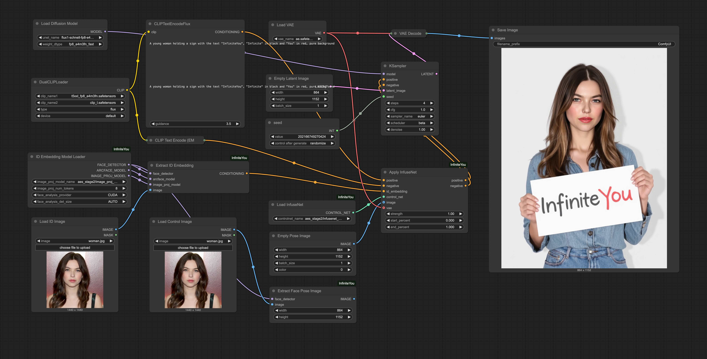
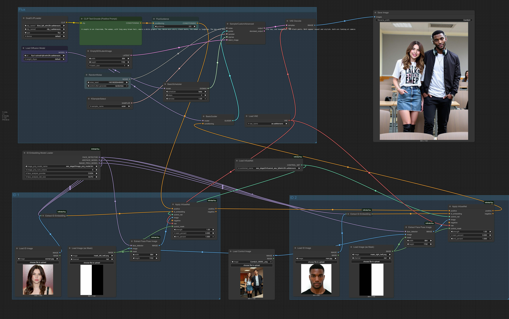

## Official ComfyUI Support - InfiniteYou: Flexible Photo Recrafting While Preserving Your Identity (ICCV 2025 Highlight)

<div align="center">

<a href="https://bytedance.github.io/InfiniteYou"></a> &ensp;
<a href="https://arxiv.org/abs/2503.16418"></a> &ensp;
<a href="https://github.com/bytedance/InfiniteYou"></a> &ensp;
<a href="https://huggingface.co/ByteDance/InfiniteYou"></a> &ensp;
<a href="https://huggingface.co/spaces/ByteDance/InfiniteYou-FLUX"></a> &ensp;

</div>

This repository provides the official ComfyUI native node supporting [**InfiniteYou**](https://github.com/bytedance/InfiniteYou) with FLUX.


<details>
<summary style='font-size:20px'><b><i>Abstract (click to expand)</i></b></summary>

> *Achieving flexible and high-fidelity identity-preserved image generation remains formidable, particularly with advanced Diffusion Transformers (DiTs) like FLUX. We introduce **InfiniteYou (InfU)**, one of the earliest robust frameworks leveraging DiTs for this task. InfU addresses significant issues of existing methods, such as insufficient identity similarity, poor text-image alignment, and low generation quality and aesthetics. Central to InfU is InfuseNet, a component that injects identity features into the DiT base model via residual connections, enhancing identity similarity while maintaining generation capabilities. A multi-stage training strategy, including pretraining and supervised fine-tuning (SFT) with synthetic single-person-multiple-sample (SPMS) data, further improves text-image alignment, ameliorates image quality, and alleviates face copy-pasting. Extensive experiments demonstrate that InfU achieves state-of-the-art performance, surpassing existing baselines. In addition, the plug-and-play design of InfU ensures compatibility with various existing methods, offering a valuable contribution to the broader community.*

</details>


## 🛠️ Workflow Example

This node adds InfiniteYou‑FLUX support to ComfyUI. In [infinite_you_workflow.json](./examples/infinite_you_workflow.json), you can find a simple workflow demonstrating its usage with either an empty face‑pose control image or a real face‑pose control image, configured to run using FLUX FP8 precision. It also shows an example running the node with FLUX.1-schnell.



**Extension:** We also provide an example [multi-id workflow](examples/multi_id_infinite_you_workflow.json) for identity-preserved image generation of two people. This uses the masked multi-region test of single-ID InfiniteYou‑FLUX models with masked residual blending, and is provided for reference only.




## 🔧 Requirements and Installation

### Dependencies

1. Install [ComfyUI](https://github.com/comfyanonymous/ComfyUI?tab=readme-ov-file#get-started).

2. Clone this repo under `ComfyUI/custom_nodes` and install the dependencies:
```
cd ComfyUI/custom_nodes
git clone https://github.com/bytedance/ComfyUI_InfiniteYou.git

cd ComfyUI_InfiniteYou
pip install -r requirements.txt
```

* Our InfiniteYou node has been added to the official Comfy Registry to ease installation: https://registry.comfy.org/publishers/yuminjia/nodes/infiniteyou. Therefore, you can also search `ComfyUI_InfiniteYou` in the ComfyUI Node Manager to install this official node.


### Memory Requirements

The full-performance BF16 model inference requires a peak VRAM of around **43GB**. Running with FP8 precision requires a peak VRAM of around **24GB**.


## 💡 Usage

1. Restart ComfyUI.

2. Import the [workflow](examples/infinite_you_workflow.json) from the [examples folder](./examples). Please use [multi-id workflow](examples/multi_id_infinite_you_workflow.json) if needed.

* Some [important usage tips](https://github.com/bytedance/InfiniteYou?tab=readme-ov-file#-important-usage-tips) can be found in our main InfiniteYou repository.


## 🏰 Required Models

### InfiniteYou and InsightFace Detection Models

This node will automatically download the following models at runtime if they not exists. Alternatively, you may download them manually into the following locations. For InfiniteYou, you need at least `image_proj_model.bin` and `infusenet_.*safetensors` of the corresponding model versions.

| Model | Location |
| ---- | ---- |
| [InfiniteYou](https://huggingface.co/ByteDance/InfiniteYou/tree/main/infu_flux_v1.0) | `ComfyUI/models/infinite_you/` |
| [InsightFace AntelopeV2](https://huggingface.co/ByteDance/InfiniteYou/tree/main/supports/insightface/models/antelopev2) | `ComfyUI/models/insightface/models/antelopev2` |

You may follow [ComfyUI FLUX examples](https://comfyanonymous.github.io/ComfyUI_examples/flux/) to download FLUX and other models for full-performance inference.  


### Other Required Models for Running FP8 Precision

The FP8 InfiniteYou model can also be downloaded automatically or manually as above. To run with FP8 precision, other models need to be downloaded manually into the following locations.

| Model | Location |
| ---- | ---- |
| [FLUX FP8](https://huggingface.co/Kijai/flux-fp8/tree/main) | `ComfyUI/models/diffusion_models` |
| [FLUX VAE](https://huggingface.co/black-forest-labs/FLUX.1-schnell/blob/main/ae.safetensors) | `ComfyUI/models/vae` |
| [Text Encoders FP8](https://huggingface.co/comfyanonymous/flux_text_encoders/tree/main) | `ComfyUI/models/text_encoders` |


## 📜 Disclaimer and Licenses

The images used in this repository and related demos are sourced from consented subjects or generated by the models. These pictures are intended solely to showcase the capabilities of our research. If you have any concerns, please feel free to contact us, and we will promptly remove any inappropriate content.

The use of the released code, model, and demo must strictly adhere to the respective licenses. Our code is released under the [Apache License 2.0](./LICENSE), and our model is released under the [Creative Commons Attribution-NonCommercial 4.0 International Public License](https://huggingface.co/ByteDance/InfiniteYou/blob/main/LICENSE) for academic research purposes only. Any manual or automatic downloading of the face models from [InsightFace](https://github.com/deepinsight/insightface), the [FLUX.1-dev](https://huggingface.co/black-forest-labs/FLUX.1-dev) base model, LoRAs ([Realism](https://civitai.com/models/631986?modelVersionId=706528) and [Anti-blur](https://civitai.com/models/675581/anti-blur-flux-lora)), *etc.*, must follow their original licenses and be used only for academic research purposes.

This research aims to positively impact the field of Generative AI. Any usage of this method must be responsible and comply with local laws. The developers do not assume any responsibility for any potential misuse.


## 📖 Citation

If you find InfiniteYou useful for your research or applications, please cite our paper:

```bibtex
@inproceedings{jiang2025infiniteyou,
  title={{InfiniteYou}: Flexible Photo Recrafting While Preserving Your Identity},
  author={Jiang, Liming and Yan, Qing and Jia, Yumin and Liu, Zichuan and Kang, Hao and Lu, Xin},
  booktitle={ICCV},
  year={2025}
}
```

We also appreciate it if you could give a star :star: to this repository and our [main repository](https://github.com/bytedance/InfiniteYou). Thanks a lot!
